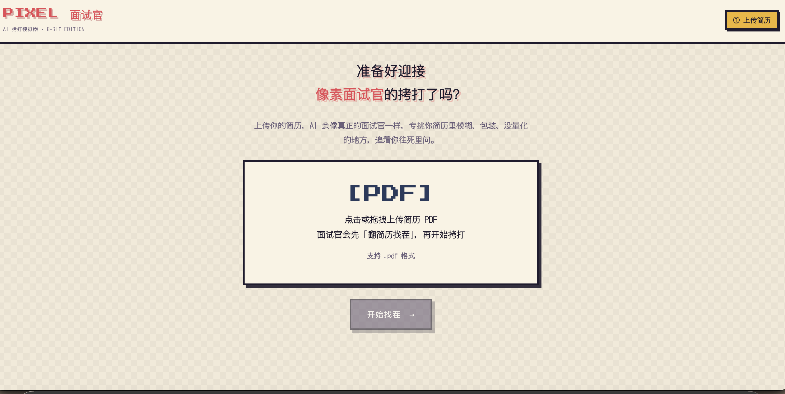
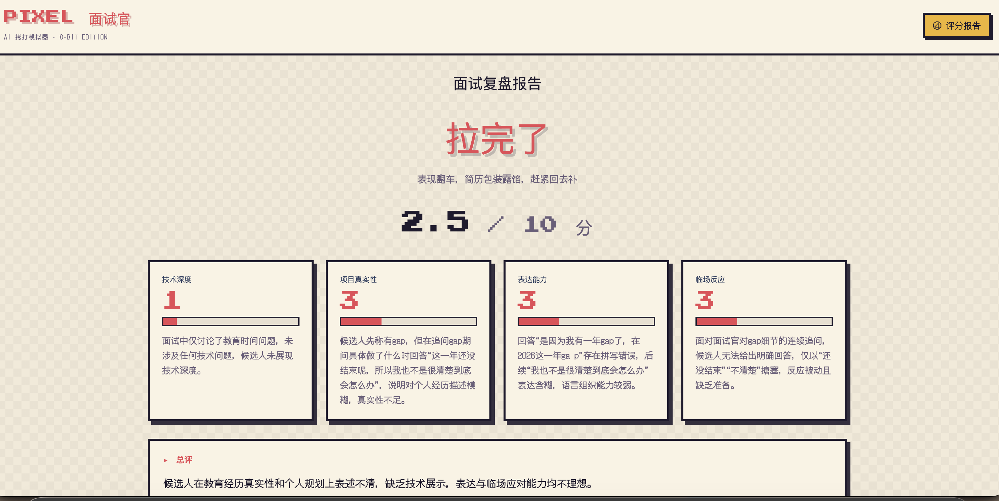

# 像素面试官 · AI 拷打模拟器

> 一个用大模型扮演「真面试官」的 AI 应用：上传简历 → AI 翻简历找茬 → 多轮「拷打式」追问 → 多维评分 + 段位称号。

不只是「温柔问答机器人」——它会像真实面试官一样，专挑你简历里**模糊、包装、没量化**的地方，追着你往死里问。答不上来？它判断出这个点你确实不会，就果断换下一个拷打点，绝不在一处死磕。

---

## ✨ 功能特性

| 功能 | 说明 |
|------|------|
| 📄 简历找茬 | 上传 PDF，AI 分析出技术栈、项目经历、以及所有「可拷打的点」 |
| 🎭 多轮拷打 | 面试官基于找茬结果逐条追问，能接住上下文，也能判断何时该换话题 |
| 📊 多维评分 | 技术深度 / 项目真实性 / 表达能力 / 临场反应，每个分数都带「依据」 |
| 🏆 段位称号 | 游戏结算式评级：人上人 / 大佬 / 夯 / 及格 / 有点悬 / 拉完了 |
| 🕹️ 像素风 UI | 复古街机像素风，等待回答时像素小人会「翻简历、冒泡思考、嘴巴开合」 |

---

## 🖼️ 界面展示

**面试对话界面**：



**面试复盘报告**（段位称号 + 多维评分卡）：



---

## 🛠️ 技术栈

- **后端**：Python + FastAPI + Uvicorn
- **大模型**：DeepSeek（OpenAI 兼容接口，`deepseek-chat` 系列）
- **PDF 解析**：pypdf
- **前端**：原生 HTML + CSS + JS（像素风，无框架，由 FastAPI 静态托管）

---

## 📁 项目结构

```
.
├── main.py                  # 入口：注册路由 + 挂载静态页面
├── config.py                # 大模型 client（读环境变量）
├── requirements.txt         # 依赖清单
├── routers/
│   ├── chat.py              # 对话接口（/chat）
│   ├── resumeAnalyze.py     # 简历分析接口（/analyze）
│   ├── interview.py         # 多轮面试接口（/interview）
│   └── report.py            # 评分报告接口（/report）
├── static/
│   └── index.html           # 像素风前端（单页，含全部 CSS/JS）
└── assets/                  # README 展示图
```

---

## 🚀 部署使用教程

### 第一步：准备环境

需要 **Python 3.13+**（本机已有）。确认版本：

```bash
python3 --version
```

### 第二步：获取 DeepSeek API Key

1. 打开 [platform.deepseek.com](https://platform.deepseek.com)，注册登录
2. 进入「API Keys」→ 创建 key → **复制保存（只显示一次）**

### 第三步：克隆项目并安装依赖

```bash
git clone https://github.com/<你的用户名>/ai-interviewer.git
cd ai-interviewer

# 创建虚拟环境
python3 -m venv .venv
source .venv/bin/activate      # Windows 用 .venv\Scripts\activate

# 安装依赖
pip install -r requirements.txt
```

### 第四步：配置 API Key

复制 `.env.example` 为 `.env`，填入你的 key：

```bash
cp .env.example .env
```

编辑 `.env`：

```
DEEPSEEK_API_KEY=sk-你的key
```

> ⚠️ **`.env` 已加入 `.gitignore`，绝不会提交到 GitHub。** 你的 key 只存在本地。

### 第五步：启动后端

```bash
uvicorn main:app --port 8000 --reload
```

看到这行说明启动成功：

```
INFO:     Uvicorn running on http://127.0.0.1:8000
```

> `--reload` 让改代码后自动重启。**这个终端窗口保持开启，别关。**

### 第六步：打开前端

浏览器地址栏访问：

```
http://localhost:8000
```

> ⚠️ **必须通过 `http://localhost:8000` 访问，不要双击 `index.html` 文件打开！** 否则会报 CORS 错误（`file://` 协议无法请求后端）。

---

## 🎮 使用教程

1. **上传简历**：点击或拖拽 PDF 简历
2. **翻简历找茬**：像素面试官会「翻简历」，找出所有拷打点并逐条展示
3. **开始面试**：点绿色按钮，面试官开始拷打（每次问一个问题）
4. **回答追问**：正常回答；也可以故意答「不知道」，看它会不会果断换话题
5. **结束面试**：点「结束面试」，生成复盘报告
6. **看报告**：段位称号 + 四个维度的分数（每条带依据）+ 薄弱点 + 改进建议

---

## 🔌 API 接口说明

| 方法 | 路径 | 功能 | 请求体 |
|------|------|------|--------|
| POST | `/chat` | 单轮对话 | `{"message": "..."}` |
| POST | `/analyze` | 上传简历 PDF，找茬 | `FormData(file=PDF)` |
| POST | `/interview` | 多轮面试（前端带全量历史） | `{"messages": [...]}` |
| POST | `/report` | 评分报告（前端带全量历史） | `{"messages": [...]}` |

**多轮对话的架构**：后端是无状态的——前端（网页）负责保存对话历史，每次请求把「完整历史」传给后端，后端拼上 system prompt 调一次 LLM 返回回复。这就是所有聊天应用（ChatGPT 等）的通用模式。

---

## ❓ 常见问题

**Q：访问报 CORS / `file:///analyze` 错误？**
A：你双击了 HTML 文件。必须通过 `http://localhost:8000` 访问，且后端在跑。

**Q：`Connection refused`？**
A：后端没启动。先跑 `uvicorn main:app --port 8000 --reload`。

**Q：报 `Missing credentials`？**
A：`.env` 没配置好，或 `DEEPSEEK_API_KEY` 没填对。

**Q：模型一直揪着一个话题不放？**
A：system prompt 里已有「换话题规则」（同一话题最多追问 2~3 次）。若还想更强，可加大这个约束的措辞。

---

## 🚧 后续规划

- [ ] 面试结束条件：AI 自主判断「拷打点问完了」自动结束并触发评分
- [ ] 语音面试（TTS/ASR）
- [ ] 面试历史存档 + 多次面试对比
- [ ] 岗位 JD 定制拷打方向
- [ ] 云端一键部署（Zeabur / Railway）

---

## 📄 License

MIT
